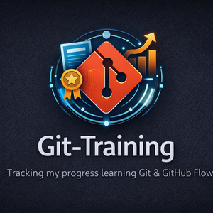

  

<h1 align="center">Git-Training</h1>

  <strong>Tracking my progress learning Git, GitHub Flow, and version control best practices.</strong>

  
  
  
  

---

## 📌 Purpose of This Repository

This repository exists to **document my learning journey with Git and GitHub**.

Rather than treating version control as something I “just use,” this repo is where I:
- practice Git workflows intentionally
- make mistakes safely
- build confidence with real project-style usage
- prepare for the **Git Foundations certification**

This is a **personal growth repository**, not a polished library.

---

## 🎯 Goals

- Build strong fundamentals in Git
- Become fully comfortable with GitHub Flow
- Practice branching, pull requests, and reviews
- Learn how Git is used in **real project workflows**
- Prepare for and pass the **Git Foundations certificate**

---

## 🧠 What I’m Practicing Here

This repo will include practice and notes related to:

- Repository initialization
- Commits and commit messages
- Branch creation and management
- GitHub Flow
- Pull Requests
- Merging strategies
- Resolving conflicts
- Tracking changes over time
- Understanding mistakes and recovery
- Working with Git in team-style scenarios

---

## 🧪 Learning Approach

This repo is intentionally:
- incremental
- transparent
- imperfect

Progress matters more than perfection.

You may see:
- small commits
- experimental branches
- trial-and-error workflows
- notes explaining *why* something was done

That’s by design.

---

## 📂 Planned Structure (Evolving)
